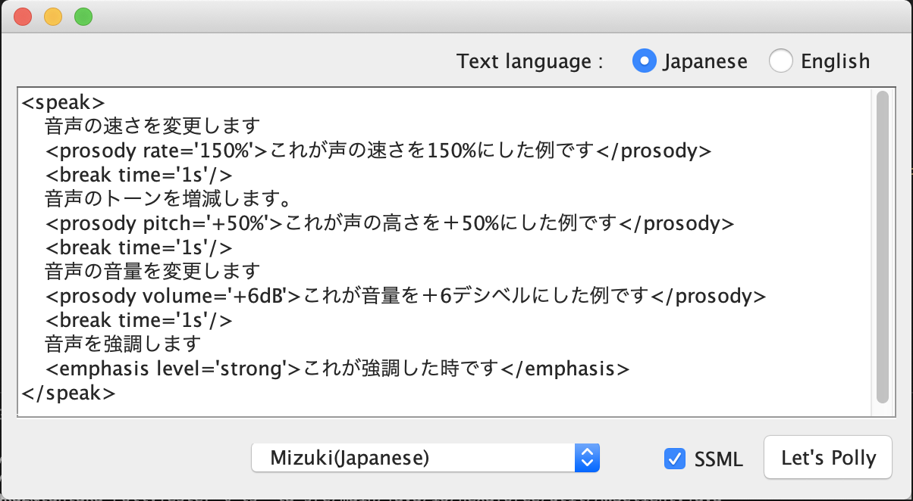

# PollyTester
Amazon Polly testing tool.

## [要]Java8とMavenがインストールされている事

### 1.AWSClient.javaにあるCredentialsを修正
```
# src/main/java/io/hexaforce/util/AWSClient.java 

	private final static BasicAWSCredentials awsCreds = //
			new BasicAWSCredentials("aws_access_key_id", "aws_secret_access_key");

```

### 2.ビルド
```
mvn clean package
```

### 3.実行
```
java -jar target/PollyTester-jar-with-dependencies.jar
```

### 使い方
* 入力テキストを日本語か英語を指定
* 読み上げる声優を選択
* テキストがSSMLの場合はチェック  

